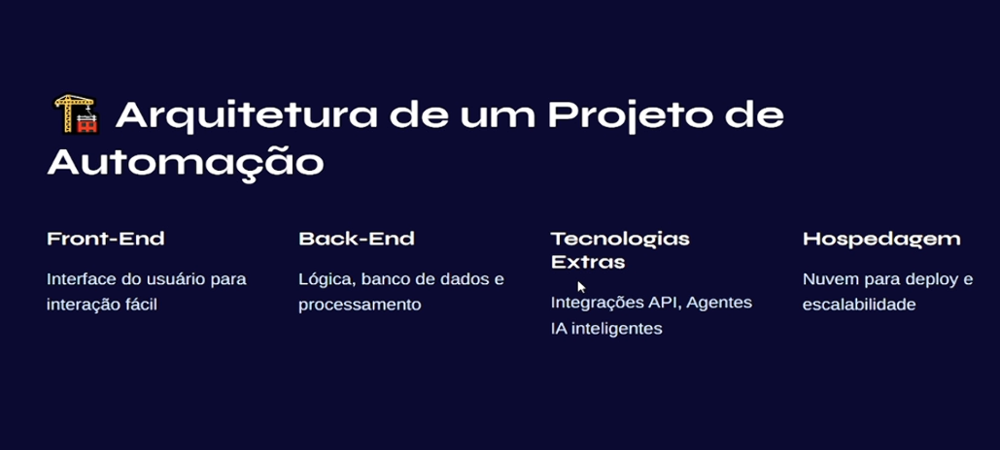
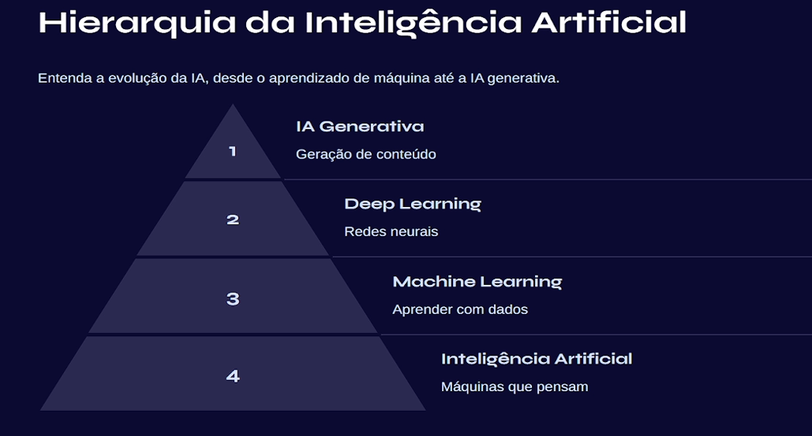
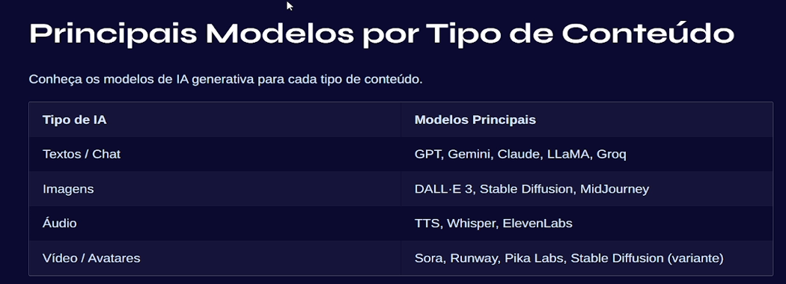
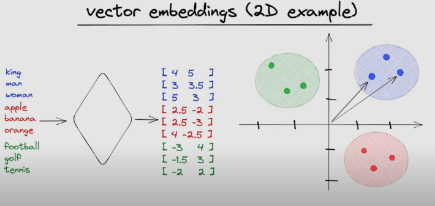

# Automation and IA Concepts

## Architecture of an automation project

**Front-end:** Whatsapp, web application, forms and so on.
**Back-end:** Supabase, Qdrant ( a vectorial database used to save data as text), and so on.
**Third technologies:** Third APIs, RabbitMQ, Webhooks, Stripe, AI agents like Open IA, DeepSeek and so on.
**Hosting** Docker, third hosting services like Railway, Hostgator, Digital Ocean and so on.

## IA concepts and hierarchy

**Generative AI**: A branch of AI that creates new content such as text, images, music, or code by learning from patterns in existing data. It powers tools like ChatGPT and image generators. Is the final solution created.

**Deep Learning**: A subset of machine learning that uses artificial neural networks with many layers to process complex data like images, speech, or natural language. It excels at pattern recognition. Responsible for recognize speak, images, and so on. Deep Learning is large used on farms where through image recognition is possible to know where to use more insecticide to save the plantation.

**Machine Learning**: A field of AI where algorithms learn from data and improve their performance over time without being explicitly programmed. It includes methods like regression, classification, and clustering.

**Artificial Intelligence (AI)**: The broad concept of machines being able to perform tasks that normally require human intelligence, such as reasoning, learning, and decision-making.

**Large Language Models (LLMs)**: A type of deep learning model trained on massive amounts of text to understand and generate human-like language. They are the engines behind tools like ChatGPT, capable of conversation, summarization, translation, and more.

Doing an analogy using cakes, AI is the kitchen, ML is the recipe process, DL is the layered complexity, LLM is a master recipe book filled with billions of cake recipes, and Generative AI is the baker creating new recipes from scratch.

**How IA understands data**

AI takes the prompt (the text you type) and breaks it into tokens, which are small pieces of words represented as numbers.
These tokens are then embedded into vectors, meaning they are placed in a mathematical space where similar meanings are close together (like in the same cluster or quadrant).
Finally, the LLM processes these embeddings, finding relationships and patterns, and uses that to generate a response that best matches your input.

## Type of databases

### Relational Databases
Traditional databases that store data in tables with rows and columns. They are best for structured data because it uses a defined data shape and provides relation between these data, using SQL for queries (e.g., MySQL, PostgreSQL). Generally the tables can be divided by **Facts** (e.g: Sellings, Refounds, and so on) or **Dimensions** (e.g: Clients, Owners, and so on).

### NoSQL Databases
Databases designed for unstructured or semi-structured data, offering flexible schemas and scalability. Examples include MongoDB and Cassandra.

### Vector Databases
Databases specialized in storing and searching vector embeddings (numerical representations of text, images, etc.). They are essential for modern AI and RAG systems, enabling similarity search and semantic queries.
