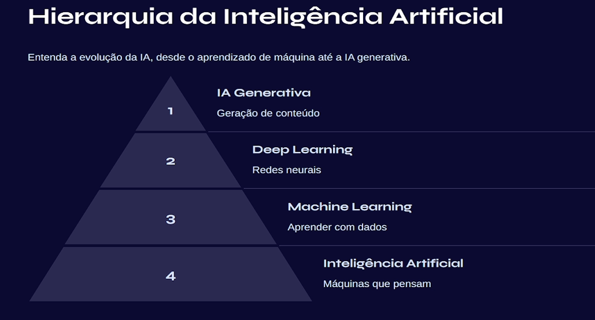
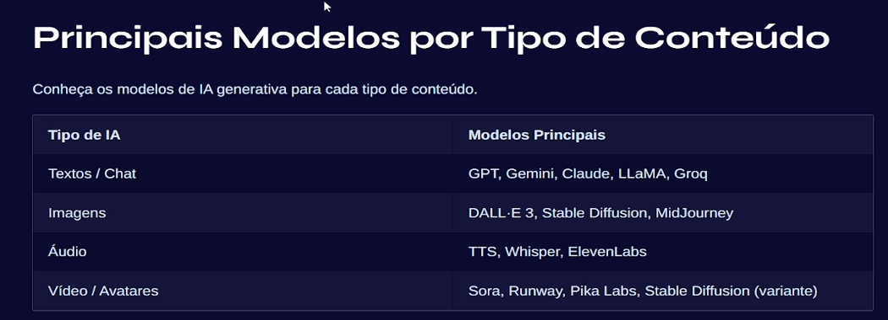
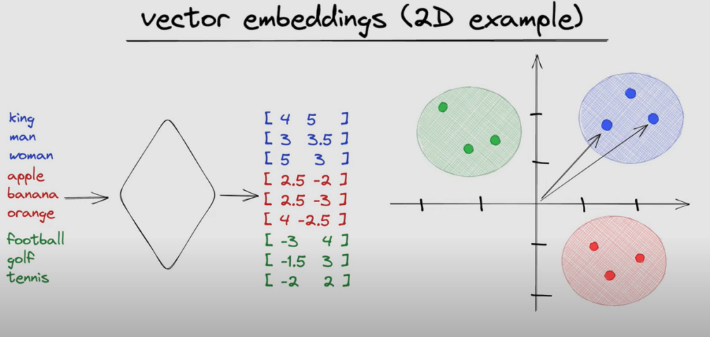

# Introduction to AI

## IA concepts and hierarchy

**Generative AI**: A branch of AI that creates new content such as text, images, music, or code by learning from patterns in existing data. It powers tools like ChatGPT and image generators. Is the final solution created.

**Deep Learning**: A subset of machine learning that uses artificial neural networks with many layers to process complex data like images, speech, or natural language. It excels at pattern recognition. Responsible for recognize speak, images, and so on. Deep Learning is large used on farms where through image recognition is possible to know where to use more insecticide to save the plantation.

**Machine Learning**: A field of AI where algorithms learn from data and improve their performance over time without being explicitly programmed. It includes methods like regression, classification, and clustering.

**Artificial Intelligence (AI)**: The broad concept of machines being able to perform tasks that normally require human intelligence, such as reasoning, learning, and decision-making.

**Large Language Models (LLMs)**: A type of deep learning model trained on massive amounts of text to understand and generate human-like language. They are the engines behind tools like ChatGPT, capable of conversation, summarization, translation, and more.

Doing an analogy using cakes, AI is the kitchen, ML is the recipe process, DL is the layered complexity, LLM is a master recipe book filled with billions of cake recipes, and Generative AI is the baker creating new recipes from scratch.

**How IA understands data**

AI takes the prompt (the text you type) and breaks it into tokens, which are small pieces of words represented as numbers.
These tokens are then embedded into vectors, meaning they are placed in a mathematical space where similar meanings are close together (like in the same cluster or quadrant).
Finally, the LLM processes these embeddings, finding relationships and patterns, and uses that to generate a response that best matches your input.

## AI subareas

- **Artificial Intelligence (AI):** The broad field focused on building systems that can perform tasks that usually require human intelligence, such as reasoning, perception, prediction, and decision-making.
- **Strong AI or AGI:** A hypothetical type of AI that would be able to generalize knowledge across many domains with human-like adaptability. It is still a future goal, not the current industry standard.
- **Weak AI or Narrow AI:** AI specialized in a limited scope, such as text generation, image recognition, recommendation systems, fraud detection, or voice assistants. Most AI systems used today are Narrow AI.
- **Symbolic AI:** An approach based on explicit rules, logic, and knowledge representation. It behaves more like a rule engine than a model that learns from examples.
- **Machine Learning (ML):** A subarea of AI in which systems learn patterns from data instead of relying only on manually programmed rules.
- **Deep Learning (DL):** A branch of ML based on neural networks with many layers. It is heavily used for speech recognition, computer vision, NLP, and generative AI.
- **Reinforcement Learning (RL):** A branch of AI in which an agent learns through rewards and penalties. It is common in robotics, game-playing systems, and decision optimization problems.
- **Generative AI:** AI focused on creating new content such as text, code, audio, video, or images based on learned patterns from existing data.

## LLMs

**LLMs** are Large Language Models such as ChatGPT, Gemini, Claude, and similar tools. They are deep learning models trained on massive amounts of text to perform tasks like:

- text generation
- summarization
- translation
- classification
- question answering
- code generation

An LLM is not automatically an agent. By itself, an LLM mainly predicts the next most probable tokens. To become an agent, it usually needs extra capabilities such as memory, tool usage, planning, and action execution.

LLMs are also limited by:

- their training data and model architecture
- the context window available in the current interaction
- hallucinations, where the model answers confidently but incorrectly
- lack of direct real-world action unless connected to tools or APIs

## AI Agents

An **AI agent** is a system that receives a goal, reasons about what to do, and can take actions to move toward that goal. In practice, an agent is often an LLM connected to:

- instructions
- memory or context
- tools and APIs
- decision rules
- an execution loop

### Common structure of an AI agent

- **Input:** User message, event, sensor data, or system trigger.
- **Reasoning:** The agent interprets the situation and decides the next step.
- **Action:** It answers, calls an API, queries a database, writes a file, sends a message, or triggers a workflow.
- **Observation:** It checks the result of the action.
- **Iteration:** If needed, it adjusts the plan and tries again.

### Main kinds of AI agents

- **Conversational agents:** Focused on dialogue with users. They answer questions, provide support, and assist in natural language interactions. Example: customer support assistants and virtual tutors.
- **Retrieval or RAG agents:** Search documents, knowledge bases, or vector databases before answering. They are useful when the response must be grounded in company data, manuals, or internal documentation.
- **Task automation agents:** Execute operational workflows such as classifying emails, filling CRM fields, generating reports, routing tickets, or sending follow-up messages.
- **Tool-using agents:** Decide which external tool to use and then execute that action. Example: checking the weather API, creating a calendar event, querying a database, or issuing a refund in an internal system.
- **Planning agents:** Break a large goal into smaller steps, execute them in sequence, and revise the plan when something fails. Example: "research competitors, summarize insights, and draft a report."
- **Monitoring agents:** Continuously watch events or metrics and react when a condition happens. Example: detect suspicious transactions, production incidents, or stock changes.
- **Multi-agent systems:** More than one specialized agent collaborates on the same problem. Example: one agent retrieves data, another analyzes it, and a third writes the final response.

### Chatbot vs AI agent

- A **chatbot** mainly focuses on conversation.
- An **AI agent** can converse, but it can also decide, use tools, and perform actions.
- In other words, every agent may expose a chat interface, but not every chatbot is really an agent.

### Examples

- A FAQ bot that only answers predefined questions is a **basic chatbot**.
- A support assistant that reads the knowledge base before answering is a **RAG agent**.
- A sales assistant that checks inventory, creates quotes, and schedules meetings is a **tool-using agent**.
- An automation flow that reads emails, extracts data, updates a CRM, and notifies the team is a **task automation agent**.

## Using databases on AI (Vector Databases)

AI uses Vector Databases to store and search vector embeddings (numerical representations of text, images, etc.). They are essential for modern AI and RAG systems, enabling similarity search and semantic queries. A model that useS external resource documents (text, PDFs, databases) and splits it into small chunks, chunking (like paragraphs in a text), and transformed into embeddings (numerical vectors).  These embeddings are stored in a vectorial database (PineCone, QDrant, Vespa, Chroma and so on) with metadata and links to the original content.

## General tips

- In real projects, it is usually better to adapt an existing model than to train a new one from zero.
- Before using an agent in production, define its goal, available tools, guardrails, and failure-handling rules.
- Use simple chatbots for predictable flows and AI agents when the system must reason and act.
- For business-critical use cases, always validate outputs, monitor behavior, and keep a human review step when necessary.

---

#ai #concepts

**Related:** [[prompt_engineering]] | [[rag_system]] | [[chatbots]] | [[handling_images_with_ai]]
