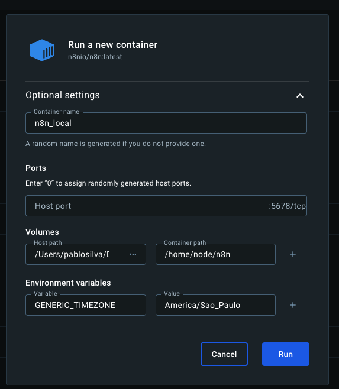

# N8N Introduction Course

## General Concepts

**N8N**: n8n is a digital automation platform that allows you to build, test and deploy AI agents with minimal or not coding.

**AI Agents**: AI agents are autonomous programs that can make decisions, perform tasks, and interact with third apps based on received instructions.

**Automation**: Automation is a set o predictable set of predetermined actions that transfers data from one point to another.

## N8N concepts
**Trigger** It's an event. It's used to call next block/actions. It will initiate or launch your workflow.
**Nodes** Nodes are building blocks that contains your instructions.
**Workflow** It's a set of connected nodes that defines your automation logic.
**Filtering** It's a filter that allows a block proceed or not to the next workflow point.
**Actions** Tasks you want to perform with a piece of data, such as Get, Send, Update, or Delete.
**Apps** It can be any official associated app to n8n. Examples: Notion, Slack, and so on.
**Functions Apps** It can be any function available in an official third app connected to n8n. Examples: A Google Sheet function to delete a row.

## Types of triggers
- **Manual**: It's fired manually to test or execute workflows on demand.
- **Scheduled**: It's fired by a schedule on specific day and date. Ex: Every Friday, every 1 hour, every Monday 5PM.
- **Instant**: It's instantly fired based on some event. Ex: On form submission, on Google Sheet property updated.

## Types of nodes
- **Entry point**: It's the first node of your workflow, the trigger node.
- **Function**: It's a node that executes an actions app function.
- **Exit point**: It's the last node of your workflow. It should be executed to tell your workflow was executed successfully.

## Useful Nodes
- **HTTP Request**: Send or receive data via APIs.
- **Set**: Define or update data within the workflow.
- **IF**: Add conditional logic to control the flow.
- **Webhook**: Receive real-time data from external sources.
- **Merge**: Combine data from multiple branches.
- **Code**: Add custom JavaScript for advanced logic.
- **Wait**: Pause workflow execution for a defined duration.

## Running N8N locally

1. Download the n8n official image running the command `docker pull n8nio/n8n`
2. Wait for the download, and after it, click on "Run" for run the image.
3. Provide your optional setting informing your container name, port, volume path mirroring and environment variables for your image. Example:

4. Click on "Run" to start the image and wait for the container starts.
5. The n8n application will be available at localhost:5678
6. Register and authenticate on the application.

## Using Templates
1. Access the left menu and click on "Templates" you'll be redirected to n8n templates website.
2. Choose a template and click on "Use for free".
3. Provide the required credentials. It can very based on the services the template requires, like access to Google Calendar, OpenAI, Google Sheets and so on (you can skip it to be configured later).  
