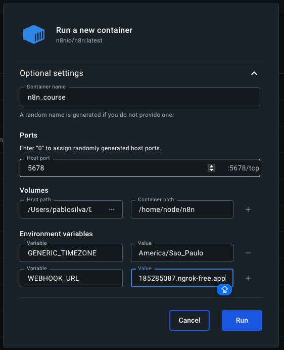

# N8N Introduction Course

## General Concepts

**N8N**: n8n is a digital automation platform that allows you to build, test and deploy AI agents with minimal or not coding.

**AI Agents**: AI agents are autonomous programs that can make decisions, perform tasks, and interact with third apps based on received instructions.

**Automation**: Automation is a set o predictable set of predetermined actions that transfers data from one point to another.

## N8N concepts
**Trigger** It's an event. It's used to call next block/actions. It will initiate or launch your workflow.
**Nodes** Nodes are building blocks that contains your instructions.
**Workflow** It's a set of connected nodes that defines your automation logic.
**Filtering** It's a filter that allows a block proceed or not to the next workflow point.
**Actions** Tasks you want to perform with a piece of data, such as Get, Send, Update, or Delete.
**Apps** It can be any official associated app to n8n. Examples: Notion, Slack, and so on.
**Functions Apps** It can be any function available in an official third app connected to n8n. Examples: A Google Sheet function to delete a row.

## Types of triggers
- **Manual**: It's fired manually to test or execute workflows on demand.
- **Scheduled**: It's fired by a schedule on specific day and date. Ex: Every Friday, every 1 hour, every Monday 5PM.
- **Instant**: It's instantly fired based on some event. Ex: On form submission, on Google Sheet property updated.

## Types of nodes
- **Entry point**: It's the first node of your workflow, the trigger node.
- **Function**: It's a node that executes an actions app function.
- **Exit point**: It's the last node of your workflow. It should be executed to tell your workflow was executed successfully.

## Trigger Nodes
- **Webhook Trigger**: Starts a workflow when it receives an incoming HTTP request (great for integrating external apps).  
- **Cron Trigger**: Executes workflows on a defined schedule (e.g., every hour, daily, weekly).  
- **Interval Trigger**: Runs workflows repeatedly at a set interval (seconds, minutes, hours).  
- **Google Sheets Trigger**: Activates when a row is created/updated in a Google Sheet.  
- **IMAP Email Trigger**: Triggers when a new email arrives in the configured inbox.  

## Data Transformation Nodes
- **Set**: Creates or updates fields in items with fixed values, variables, or expressions.  
- **Function**: Run custom JavaScript across all items in a single function block.  
- **Function Item**: Apply JavaScript logic individually on each item.  
- **Merge**: Combine two input streams (append, merge by key, wait for both).  
- **SplitInBatches**: Breaks a data set into smaller chunks to process sequentially.  
- **IF**: Conditional branching, sending items down true/false paths based on logic.  
- **Switch**: Routes data into multiple outputs depending on matching case values.  
- **Limit**: Restrict the number of items passed forward (useful for testing).  
- **Rename Keys**: Changes property names of fields in data items.  

## API & HTTP Nodes
- **HTTP Request**: Send HTTP/HTTPS requests to external APIs (supports auth, headers, body).  
- **GraphQL**: Perform GraphQL queries or mutations against compatible APIs.  
- **Webhook**: Expose endpoints to receive or return data to external services.  

## Database Nodes
- **MySQL**: Run SQL queries, insert, update, or delete rows in a MySQL DB.  
- **Postgres**: Execute SQL operations in a PostgreSQL database.  
- **SQLite**: Query or update SQLite databases.  
- **MongoDB**: Insert, update, query, or delete documents in MongoDB collections.  

## File Nodes
- **Read Binary File**: Load a file from disk into the workflow as binary data.  
- **Write Binary File**: Save binary workflow data to a local file.  
- **Move Binary Data**: Convert fields from JSON into binary data or vice versa.  

## Messaging & Communication Nodes
- **Email Send**: Sends email via SMTP or third-party email providers.  
- **Slack**: Post messages, read channel data, or manage users in Slack.  
- **Telegram**: Send or receive messages with Telegram bots.  
- **Discord**: Interact with Discord servers (send messages, manage roles/channels).  

## Cloud & Storage Nodes
- **Google Drive**: Upload, download, or search files in Google Drive.  
- **Dropbox**: Manage and move files/folders in Dropbox.  
- **AWS S3**: Upload, download, list, or delete objects from S3 buckets.  

## Utility Nodes
- **Wait**: Pause execution until a specific time or condition is reached.  
- **NoOp**: Does nothing, passes input as output (useful for testing/debugging).  
- **Error Trigger**: Starts when another workflow fails (error handling).  
- **Execute Workflow**: Call another workflow from within the current workflow.  
- **Execute Command**: Runs shell/system commands on the host machine.  

## Useful Nodes
- **HTTP Request**: Send or receive data via APIs.
- **Set**: Define or update data within the workflow.
- **IF**: Add conditional logic to control the flow.
- **Webhook**: Receive real-time data from external sources.
- **Merge**: Combine data from multiple branches.
- **Code**: Add custom JavaScript for advanced logic.
- **Wait**: Pause workflow execution for a defined duration.

## Running N8N locally with Ngrok

1. Download the n8n official image running the command `docker pull n8nio/n8n`
2. Wait for the download, and after it, click on "Run" for run the image.
3. Configure your Ngrok credentials and run the command `ngrok http 5678` to create a Ngrok tunnel for 5678 port.
4. Provide your optional setting informing your container name, port (5678), volume path mirroring and environment variables for your image (if you are using webhook urls, add this environment variable too). Example:

1. Click on "Run" to start the image and wait for the container starts.
2. The n8n application will be available at your generated Ngrok URL.
3. Register and authenticate on the application.

## Running N8N locally with Ngrok and definitive domain

This tutorial is useful for keep using the same Ngrok domain instead needing configuring it again every time the container restarts or the temporary domain expires.

1. Clone this [repository](https://github.com/Joffcom/n8n-ngrok).
2. Edit .env file to use your Ngrok domain and your Ngrok Auth token.
3. Edit the ngrok.yml file passing your Ngrok's domain.
4. Run docker-compose up to start the container.
5. Use the application normally.

## Listening to webhooks using Tally forms
1. Check if the container image was created supplying a environment variable for WEBHOOK_URL.
2. Create a new Webhook node (not Respond to Webhook node), select the method POST because we are listening a form submission that is performed using POST method, and copy the Test URL.
3. Register and authenticate on [Tally](https://tally.so/dashboard). At dashboard, click on "New form", then "Use a template", select a template, click on "Use template", and click on "Publish".
4. Click on "Integrations", "Webhooks", click on "Connect", and provide your Test URL generated by your n8n Webhook node, and click on "Connect".
5. On n8n Webhook node click on "Listen for test event".
6. Fill the Tally form an the response will be returned at n8n.

## Configuring Nodes that depends on Google authentication and authorization
1. Access your GCP account.
2. Create a new project and select it.
3. Click on "Services and APIs", click on "Library".
4. Search for the API you want to integrate, eg. "Google Sheets", "Gmail" and so on.
5. Select the desired API and enable it.
6. Click on "Credentials", click on "Create", and select "Create OAuth client ID".
7. Select a Application type (generally web), provide a name, add an authorized redirect URI (should contain the HTTPS protocol), and click on "Create".
8. Copy the client id and client secret and download the generated JSON file.
9. Click on the new credential created and click on "Data access", "Add or remove scopes", and enable all scopes and the scope you want to work with, eg. "Google Sheets", "Gmail" and so on.
10. Click on "Audience" and click on "Publish".
11. On n8n, on the node that depends on Google, click on "Select credential", click on "Create new credential", and provide the client id and client secret generated.
12. Execute your service. 

## Using Templates
1. Access the left menu and click on "Templates" you'll be redirected to n8n templates website.
2. Choose a template and click on "Use for free".
3. Provide the required credentials. It can very based on the services the template requires, like access to Google Calendar, OpenAI, Google Sheets and so on (you can skip it to be configured later).  

## Using Community nodes
1. Click on your avatar image at bottom at left panel.
2. Click on "Settings", "Community Nodes", and type the name of the community node to install, example: "n8n-nodes-evolution-api" and click on install.

# General tips
- Prefer configuring n8n with Docker and Ngrok using [this repository](https://github.com/Joffcom/n8n-ngrok) because it configures a permanent Ngrok domain persisting the url without resetting it every time the container stops.
- Configure your URL including the protocol because it avoids conflicts and mismatching between the URL server and URL authorized on services like Google.
- At working with forms using webhooks, the form id and webhook path must be exactly the same otherwise the communication wont be succeeded. 
- You should enable each Google API/Service that you need to work with separately and add scopes for it.  
- Do not create an Ai agent with too many responsibilities (too many connected tools), prefer creating separated agents and make them communicate between themselves.
- At working on different projects, keep the each project linked to a separated Google project. Do not mix up projects.
- Avoid using gpt4 mini model for small tasks, prefer using gpt4-o.
- At working witch tools linked to an AI Agent, the ability to enable the correct tool will depend on how strong and well formed your prompt is. Having too many tools does not means all these tools will be executed, but are possible to be executed according to your prompt.
- Use PineCode to store data on vector database when RAG is needed. RAG will be needed when it's necessary to add an external/private context (like a database containing business data) to the AI model instead relying only on the global training database.
- Always configure the correct dimension of an index at working with an index database.
- If some recourse is not being listed, check if the credentials for that resource was provided.
- At working with workflows that uses webhooks and you want to put it on production, use the production URL on the webhook service and activate your flow, otherwise it won't work.
