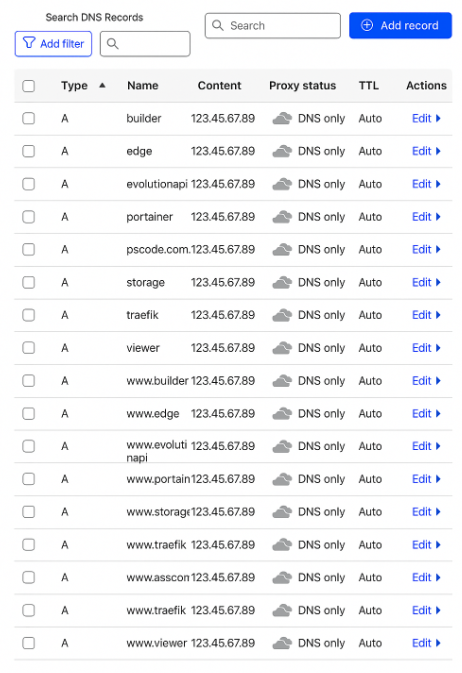

## Configuring domains and DNS using Cloudflare.

### What is Cloudflare?

[Cloudflare](https://www.cloudflare.com/) is a global **content delivery network (CDN)** and **security platform** that helps improve your website’s **speed, reliability, and protection**. It acts as an intermediary between your users and your hosting server, caching content and filtering malicious traffic.

**Main Benefits:**
- **Faster Loading Times:** Uses global edge servers to deliver content closer to users.
- **Enhanced Security:** Protects against DDoS attacks, spam, and malicious bots.
- **Free SSL Certificates:** Provides HTTPS encryption for secure connections.
- **DNS Management:** Offers a simple, fast, and reliable way to manage DNS records.
- **Analytics:** Monitors traffic and performance in real-time.

## Steps to configure domains and DNS using Cloudflare.

1. Create and authenticate on your Cloudflare account. Click on "Add domain", inform the domain you have in services like RegistroBR or GoDaddy, select the free plan, and click on "Continue".
2. Click on "Continue to activation" and copy the provided URLS (valid examples: "jabbar.ns.cloudflare.com" and "walterfool.ns.cloudflare.com").
3. Login on your domain registration service (RegistroBR or GoDaddy), and click on your domain, and click on "Alterar servidores DNS", and paste the generated DNS records generated by Cloudflare on server 1 and server 2 fields.
4. Wait for until 24h for DNS activation. If everything has been succeeded, the domain will be shown as active at Cloudflare's dashboard.

## Configuring subdomains on Cloudflare

1. Access your application home dashboard (click on Cloudflare logo).
2. Click on your registered domain.
3. Click on "Records".
4. And click on "Add record", for each subdomain, create a record containing the subdomain and another to www.subdomain (see the image below) and disabling the proxy option.
5. 